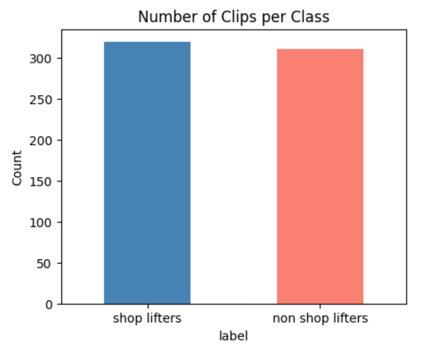
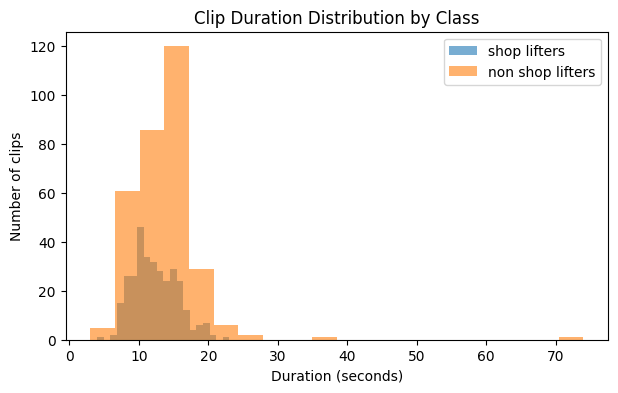
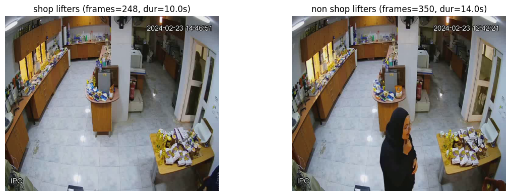
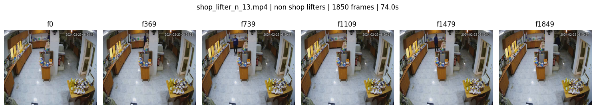
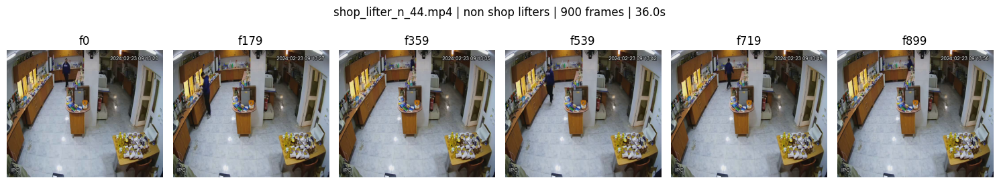
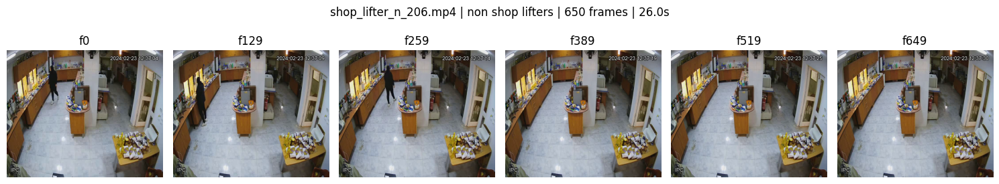
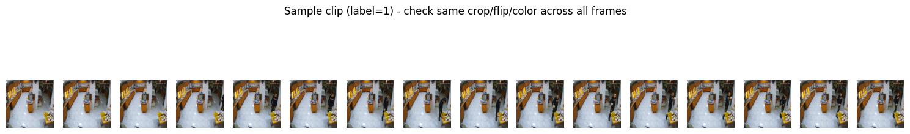
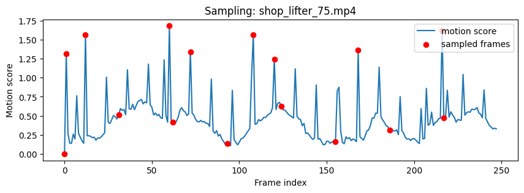
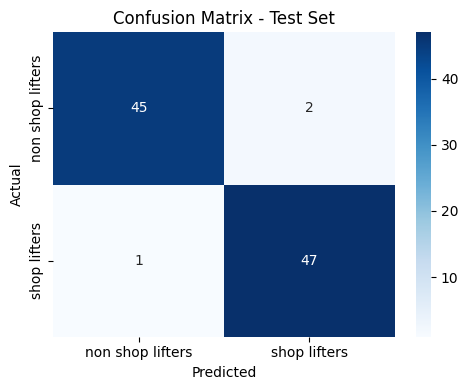
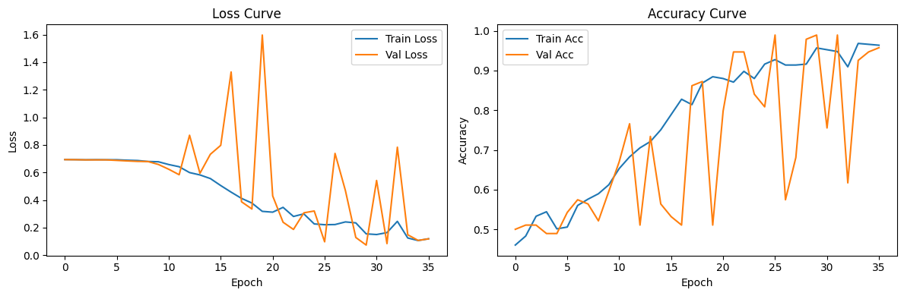

# Shoplifting Detection — Video Classification

A video classification pipeline that distinguishes normal shopping behavior from shoplifting/theft acts using a from-scratch temporal deep learning architecture.

## Overview

The model classifies short surveillance video clips into two categories — **shoplifter** vs **non shoplifter** — using a 3D Convolutional Neural Network trained entirely from scratch (no pretrained weights).

## Table of Contents

- [Dataset](#dataset)
- [Preprocessing](#preprocessing)
- [Frame Sampling Strategy](#frame-sampling-strategy)
- [Pipeline](#pipeline)
- [Model](#model-—-3d-cnn-from-scratch)
- [Training](#training)
- [Results](#results)
- [Repository Structure](#repository-structure)
- [Requirements](#requirements)
- [Notes](#notes)

## Dataset

- **Link**: [Shoplifting Dataset (Kaggle)](https://www.kaggle.com/datasets/bavlysoliman/detect-shopping)
- **Structure**: organized into `shop lifters` and `non shop lifters` folders.
- **Raw size**: 855 video clips, uniform resolution of 704×576 at ~25 fps.
- **Cleaning**: Identified and removed 225 duplicate clips (files with a `_1` filename suffix), leaving **630 unique clips** — 319 shoplifters / 311 non-shoplifters, a near-balanced set.

### Class Distribution



### Clip Duration Distribution

Most clips fall between 8–16 seconds, with a long tail of longer clips in the non-shoplifter class.



### Frame Count Distribution

Frame counts (at ~25 fps) mirror the duration distribution and directly inform the target frame count `T` used in sampling.


### Sample Frames per Class



### Outlier Inspection

Statistical outliers (very long/short clips, flagged via IQR) were visually inspected frame-by-frame to confirm they were legitimate clips rather than corrupted files.





## Preprocessing

- **Exploratory Data Analysis** — class distribution, clip duration and frame-count distributions, resolution check, and visual inspection of sample frames and statistical outliers.
- **Duplicate Removal** — regex-based detection of `_1`-suffixed duplicate files, dropped prior to splitting to avoid train/test leakage.
- **PyTorch Dataset** — returns clip tensors of shape `(T, C, H, W)`. Random flip, crop, and color-jitter parameters are sampled **once per clip** and applied identically to every sampled frame, preserving temporal consistency of the augmentation.

### Consistent Per-Clip Augmentation

The same crop, flip, and color-jitter parameters are applied across every frame in a clip — only the scene content changes frame to frame, not the augmentation itself.



## Frame Sampling Strategy

A hybrid sampler combining:

- **Uniform sampling** across the full clip duration (guarantees even temporal coverage regardless of clip length).
- **Motion-aware sampling**, using frame-to-frame pixel-difference scores to bias frame selection toward high-motion moments, reducing the risk of missing brief shoplifting actions.
- Short clips (fewer frames than the target `T`) are handled by taking every frame and padding with repeated final frames.

### Frame Sampling in Action

Red points mark the frames selected by the hybrid sampler — note how selections cluster around motion spikes (likely action moments) while still spanning the full clip duration.



## Pipeline

1. Exploratory Data Analysis
2. Duplicate removal
3. Frame sampling (hybrid uniform + motion-aware)
4. PyTorch Dataset construction with consistent per-clip augmentation
5. Model — 3D CNN built from scratch
6. Training with early stopping
7. Evaluation on held-out test set

## Model — 3D CNN (from scratch)

A 4-block Conv3D/BatchNorm3D/ReLU/MaxPool3D architecture with global average pooling and a fully connected classifier head. No pretrained backbone is used; weights are initialized with Kaiming initialization.

## Training

Stratified 70/15/15 train/val/test split, class-weighted cross-entropy loss, Adam optimizer with weight decay, `ReduceLROnPlateau` learning-rate scheduling, and early stopping based on validation F1-score.

## Results

Final evaluation on the held-out test set (95 clips):

| Metric | Score |
|---|---|
| Accuracy | 0.9684 |
| Precision | 0.9592 |
| Recall | 0.9792 |
| F1-score | 0.9691 |
| Loss | 0.1065 |

### Classification Report

| Class | Precision | Recall | F1-score | Support |
|---|---|---|---|---|
| non shop lifters | 0.9783 | 0.9574 | 0.9677 | 47 |
| shop lifters | 0.9592 | 0.9792 | 0.9691 | 48 |
| **Accuracy** | | | **0.9684** | 95 |
| Macro avg | 0.9687 | 0.9683 | 0.9684 | 95 |
| Weighted avg | 0.9686 | 0.9684 | 0.9684 | 95 |

### Confusion Matrix



### Training Curves

Loss and accuracy curves across training and validation, with early stopping applied on validation F1-score.



## Repository Structure

```
├── assets/                          # README visuals
│   ├── augmentation_check_0.png
│   ├── class_distribution_0.png
│   ├── confusion_matrix_0.png
│   ├── duration_distribution_0.png
│   ├── framecount_distribution_0.png
│   ├── motion_sampling_0.png
│   ├── outlier_frames_0.png
│   ├── outlier_frames_1.png
│   ├── outlier_frames_2.png
│   ├── sample_frames_0.png
│   └── training_curves_0.png
├── README.md
├── shoplifting-detection.ipynb      # Full notebook: EDA → sampling → dataset → model → training → evaluation
├── shoplifting.ipynb                # Earlier working notebook version
├── video_metadata.csv               # Extracted per-clip metadata (raw)
└── video_metadata_clean.csv         # Metadata after duplicate removal
```

## Requirements

- Python 3.x
- PyTorch, torchvision
- OpenCV (`opencv-python`)
- pandas, numpy, matplotlib, seaborn
- scikit-learn

## Notes

- The model is trained **entirely from scratch** — no transfer learning.
- The frame sampling strategy was specifically designed to reduce the chance of missing short, localized shoplifting actions within longer clips, in addition to satisfying the requirement of even coverage across the full video duration.
- The model achieves strong, balanced performance across both classes (F1 ≈ 0.97 for each), indicating the motion-aware sampling and consistent augmentation strategy were effective despite training from scratch on a moderately small dataset (630 clips).

---
*Built by Menna Thabet @ Cellula Technologies*
